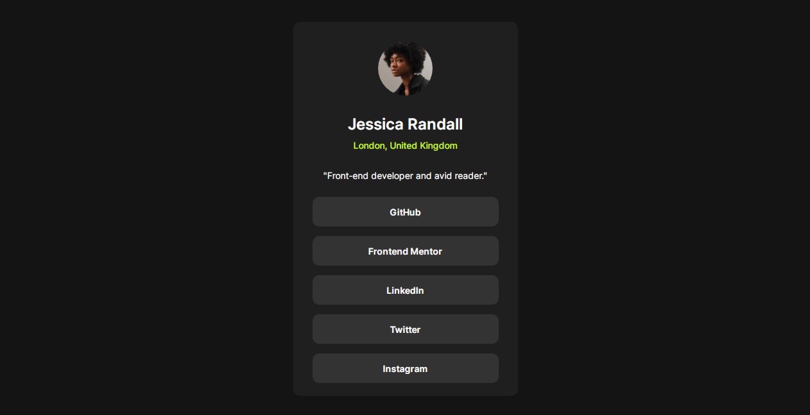

# Frontend Mentor - Social Links Profile Card


## Overview



A simple and elegant social links profile card built using HTML and CSS. This card features a user profile with social media links and a hover effect on the links. The layout is created primarily using Flexbox.

## Features

- Clean and modern design.
- Responsive layout using Flexbox.
- Hover effect on social media links.

## Built with

- Semantic HTML5 markup
- CSS custom properties
- Flexbox

## Usage

1. clone or download the repository

```bash 
  git clone https://github.com/your-username/social-links-profile-card.git
  cd social-links-profile-card
```

2. open the `index.html` file in your browser.

## Links

- Live Site URL: [social link profile card](https://social-links-profile-card-100.netlify.app/)

## License
This project is licensed under the MIT License. 

## Author
Kingsley Kamkwamba
- Frontend Mentor - [@kingsley](https://www.frontendmentor.io/profile/kingsley2o18)
- Twitter - [@kingsley](https://www.x.com/_kingsl3y)


## Acknowledgments

Frontend Mentor (Challenge & Design)
